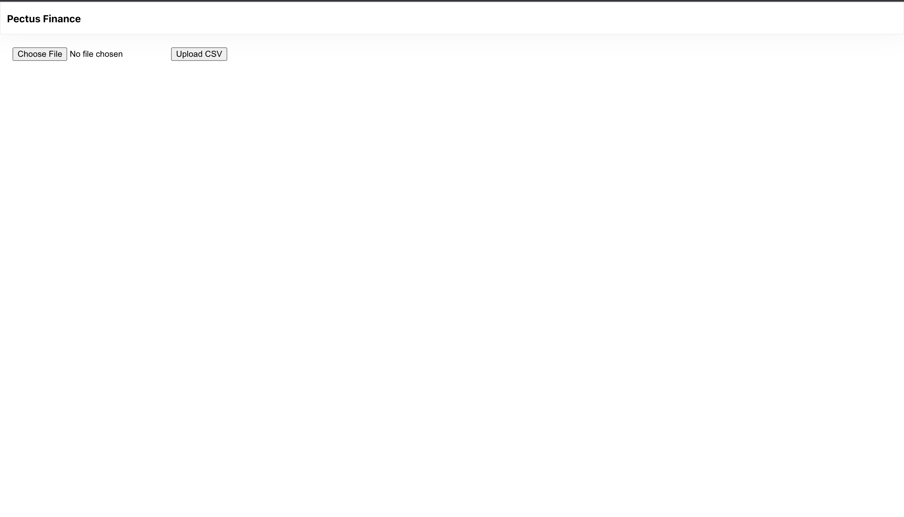
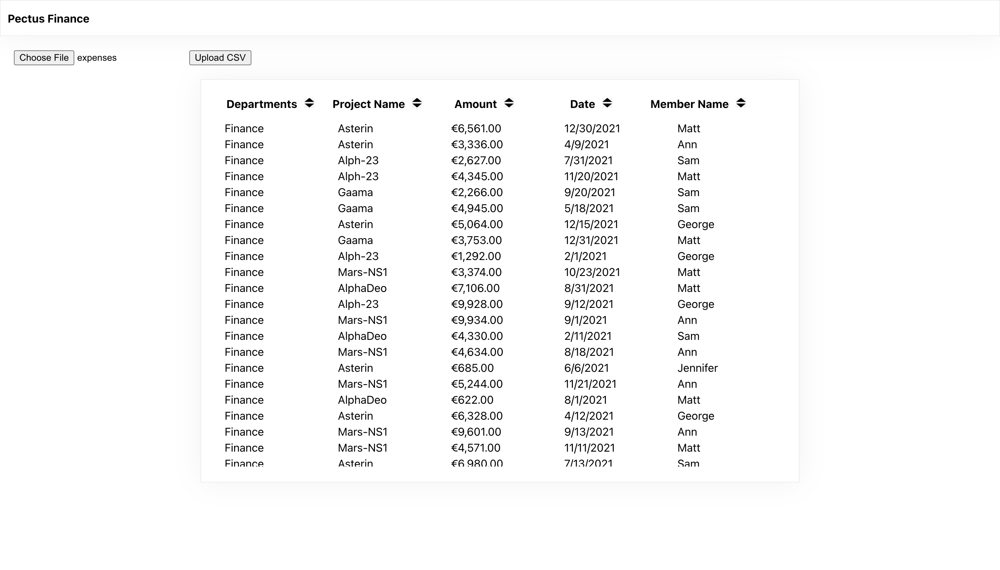
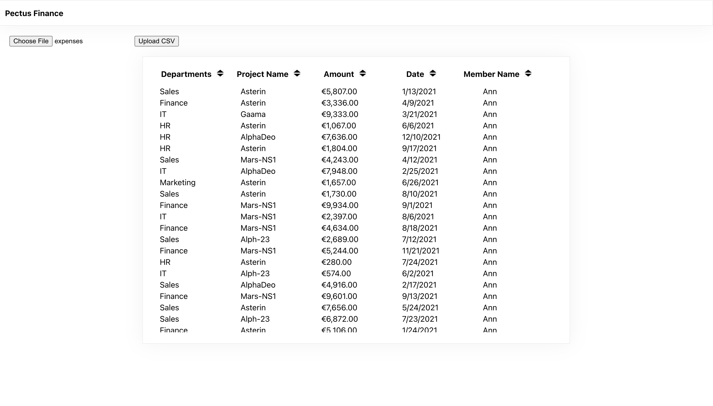
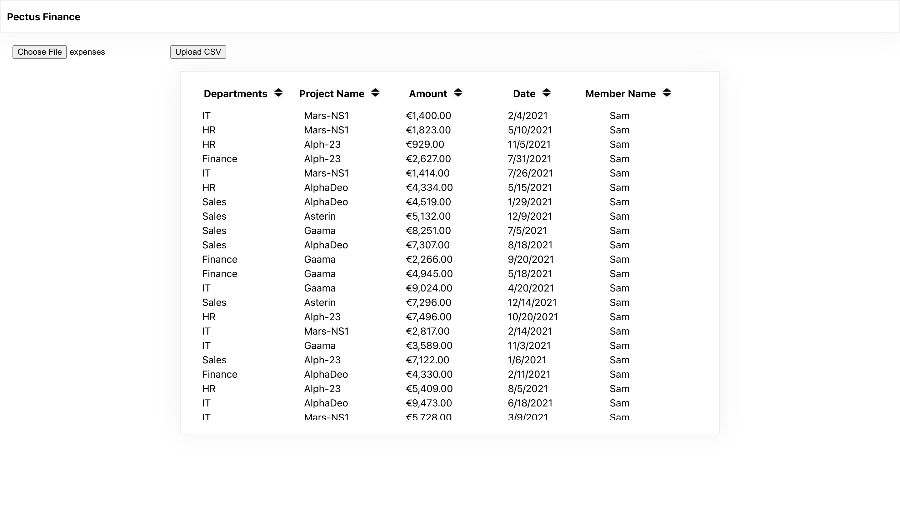

# Getting Started with Create React App

This project was bootstrapped with [Create React App](https://github.com/facebook/create-react-app).

## Available Scripts

To run this app on your local system, you can do the following;

Clone the application using `git clone git@github.com:zeze111/pectus-finance-challenge.git`

Change the directory on your terminal to the project folder e.g `cd pectus-finance-challenge`

Install on node dependencies using `npm install`

In the project directory, you can run:

### `npm start`

Runs the app in the development mode.\
Open [http://localhost:3000](http://localhost:3000) to view it in the browser.

The page will reload if you make edits.\
You will also see any lint errors in the console.

### `npm test`
Runs the tests written with jest and enzyme.

### `npm lint`
Runs the linting operation across all javascript and typescript files

## Tech Stack
This project was built using the following technologies:
- React
- Typescript
- Styled Components for css stylings
- Jest/Enzymes for testing

## Acceptance Criteria
As a user:

- I want to see a expanses data in tabular form.
- I should able to perform sort(asc/descending order) operation by clicking on each column header
- I should able to see total sum of expanses by departments, project_name, date and by member_name
- I should able to see total sum of value in amount column

## Finished Product
I was able to implement the first 2 requirements of the A/C which is to display expenses data in tabular form and allow for column sorting. Due to the 3hrs time limit, I was unable to attempt the other 2 functionalities.

Notes:
- I have worked with typescript in the past but in situations where it had already been set up. Although bootstrapping the app helped with majority of the setup, I still had some manual changes to make especially with jest. It was a bit challenging but I was able to reslve all issues surronding that.
- Would also like to note this was my first experience with styled components, not challenging but definitely eye opening in regards to usability, readability and maintainablility.

### Homepage:
This is the first view the user interacts with, it consist of a field and button that allows the user upload the csv file for viewing

### Table View:
- The first screenshot shows the table view of the csv file. In this view, the user has clicked on the `Department` column, resulting in an ascending sort of that column.
- The second screenshot shows the table sorted by name in ascending order
- The third screenshot shows the table sorted by name in descending order

